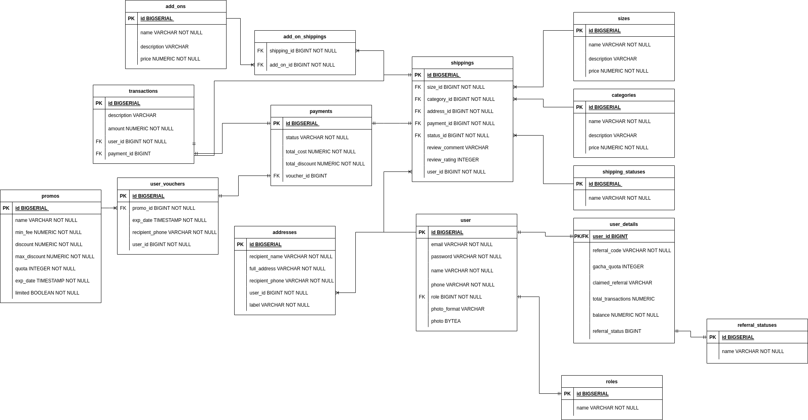

## START
Run go run . to run app
## SETUP

### ENV PARAMS
db config:
DB_NAME = /Name of database/
DB_HOST = /Host of databse/
DB_USER = /User name/
DB_PASSWORD = /Database password/
DB_PORT = /Database port/

auth config:
SECRET = /Secret to hash password/
TOKEN_DUR = /Duration of valid token in seconds/

referral config:
REFERRAL_CLAIMER_REWARD = /Referral Reward/
REFERRAL_CLAIMER_TRESHOLD = /Referral Treshold/
REFERRAL_OWNER_REWARD = /Referred referral reward/
REFERRAL_OWNER_TRESHOLD = /Referred referral treshold/

top up config:
TOPUP_MIN_TRESHOLD = /Minimum topup treshold/
TOPUP_MAX_TRESHOLD = /Maximum topup treshold/

## ERD
